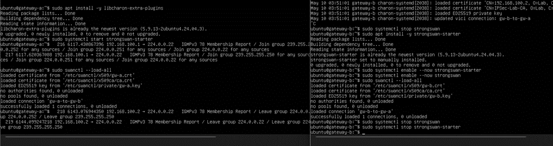
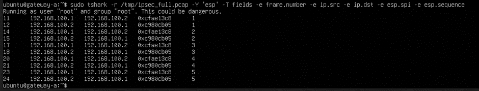
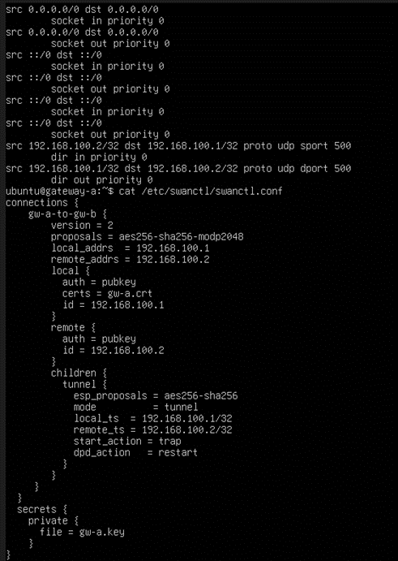

# StrongSwan IPSec VPN Lab

## Overview

This project demonstrates a full Gateway-to-Gateway IPSec VPN implementation using:

- strongSwan
- IKEv2
- Certificate-Based Authentication
- OpenSSL PKI
- tshark / Wireshark traffic analysis
- Ubuntu 24.04

The lab was built inside Oracle VirtualBox using two Ubuntu virtual machines connected over an internal network.

---

## Technologies Used

- Ubuntu 24.04
- strongSwan
- OpenSSL
- tshark
- Wireshark
- VirtualBox
- IPSec
- IKEv2
- ESP Encryption

---

## Key Features

- Gateway-to-Gateway VPN tunnel
- Certificate-based authentication
- Custom OpenSSL PKI
- IKEv2 negotiation
- ESP encrypted traffic
- Traffic capture and analysis
- SAD / SPD / PAD inspection

---

## Screenshots

### Tunnel Setup


### ESP Traffic Analysis


### strongSwan Configuration


---

## Report

The complete lab report is included in:

```text
IPSec_VPN_Report_ZM.docx
